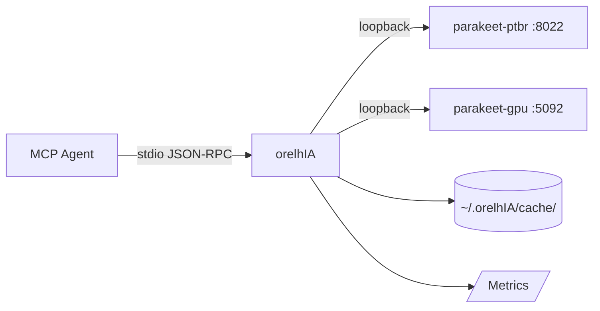

# orelhIA

> **Local audio transcription, fast and private — for MCP agents.**
>
> orelhIA · Parakeet TDT · Docker · LRU Cache · VAD · Metrics · Native PT-BR

[](https://python.org)
[](https://modelcontextprotocol.io)
[](./LICENSE)
[](./tests/)
[](https://github.com/speaches-ai/speaches)

[🇧🇷 **Português**](./README.md) · [🇺🇸 **English**](#english) · [📐 **Architecture**](./docs/ARCHITECTURE.md) · [🤝 **Contributing**](./CONTRIBUTING.md)

---

# English

## ⚡ TL;DR

```bash
# 1. Install (after the MCP server is configured)
pip install -e ".[dev,record]"

# 2. Bootstrap the Parakeet container (idempotent — Docker + image + container)
python -m parakeet_bootstrap

# 3. Transcribe!
python cli/whisper audio.ogg -l pt
# → "Olá, isto é um teste do orelhIA"
```

Via MCP (from your agent):

```python
bootstrap_parakeet()        # install and start (idempotent)
transcribe_file("/tmp/audio.ogg", language="pt")
# → {"text": "Olá, ...", "language": "pt", "duration": 4.5, "_meta": {...}}
```

---

## ✨ Features

| Category | What you get |
|---|---|
| **Transcription** | local file · URL · microphone · with or without VAD |
| **Models** | 4 Parakeet TDT models (CPU + GPU CUDA) |
| **Backend** | Parakeet TDT 0.6B v3, **native PT-BR** (Alefiury/TAGARELA) |
| **Performance** | GPU 5-10× faster than CPU · LRU cache 18,000× speedup on hits |
| **Security** | SSRF guard · safe redirect handler · MIME map · size limit · FD-safe temp |
| **Observability** | in-memory metrics (counters, latency, cache hit rate) |
| **DevEx** | stdlib-only where possible · type hints · pytest · ruff + mypy |
| **Idempotency** | bootstrap re-detects Docker, image, container, daemon |

---

## 🏗 Architecture



> See [`docs/ARCHITECTURE.md`](./docs/ARCHITECTURE.md) for full diagrams (sequence, layered, security).

---

## 🚀 Quick start

### 1. Prerequisites

- **Python 3.10+**
- **Docker Desktop** (Windows/macOS) or **Docker Engine** (Linux)
- **4 GB RAM** minimum (8 GB recommended for the large model)
- **NVIDIA GPU optional** (CUDA 12.1+ for 5-10× speedup)

### 2. Installation

```bash
# Clone (or copy the orelhIA/ directory)
cd orelhIA

# Editable install
pip install -e ".[dev,record]"
```

### 3. Configure the MCP client

Add to your `~/.pi/agent/mcp.json` (or equivalent):

```json
{
  "mcpServers": {
    "whisper": {
      "command": "C:/Users/Evandro/AppData/Local/Programs/Python/Python312/python.exe",
      "args": ["C:/Users/Evandro/.pi/agent/mcp-servers/whisper/server.py"],
      "description": "Parakeet TDT transcription via parakeet-gpu container (RTX 3070, CUDA). v3.0",
      "timeout": 180,
      "lifecycle": "lazy",
      "idleTimeout": 10,
      "directTools": true,
      "environment": {
        "ORELHIA_BASE_URL": "http://localhost:5092",
        "ORELHIA_MODEL": "alefiury/parakeet-tdt-0.6b-v3-ptBR-TAGARELA-onnx",
        "ORELHIA_TIMEOUT": "120",
        "ORELHIA_MAX_BYTES": "26214400",
        "ORELHIA_CACHE_DIR": "C:/Users/Evandro/.orelhIA/cache",
        "ORELHIA_CACHE_MAX_ENTRIES": "128"
      }
    }
  }
}
```

### 4. Start the backend (idempotent)

```bash
python -m parakeet_bootstrap
```

Expected output:

```
[  5%] docker.check: Verificando Docker...
[ 15%] docker.check: Docker já instalado e rodando
[ 25%] image.check: Verificando imagem parakeet-tdt:ptbr-cpu...
[ 50%] image.check: Imagem parakeet-tdt:ptbr-cpu já presente
[ 80%] container.reuse: Container parakeet-ptbr já rodando, reusando
[ 75%] health.wait: Aguardando http://localhost:8022/health ficar healthy...
[  95%] health.wait: healthy após 1 tentativas
[100%] done: Bootstrap completo

[OK] parakeet rodando em http://localhost:8022
```

### 5. Use it!

```bash
# CLI
python cli/whisper audio.ogg -l pt

# MCP (via agent)
transcribe_file("audio.ogg", language="pt")
```

---

## 🛠 Tools (MCP)

| Tool | What it does | Parameters |
|---|---|---|
| `health()` | Backend status + features | — |
| `transcribe_file(path, language?, model?, format?, preprocess?)` | Local file → text | `path` (required), others optional |
| `transcribe_url(url, language?, model?)` | HTTP(S) URL → text | `url` (required) |
| `record_audio(seconds, output_path?, language?, model?, sample_rate?)` | Microphone → text | `seconds` (1-600) |
| `get_metrics()` | Counters, latency, cache hit rate | — |
| `clear_cache()` | Clear LRU cache | — |
| `bootstrap_parakeet(port?, image?, container?)` | Install Docker + container (idempotent) | all optional |

### Example: transcription with VAD

```python
transcribe_file(
    path="audio_with_silence.wav",
    language="pt",
    preprocess="vad",  # removes silence before transcribing
)
```

### Example: `get_metrics()` response

```json
{
  "uptime_seconds": 3600.5,
  "requests": {
    "total": 150, "success": 147, "error": 3,
    "by_tool": {"transcribe_file": 120, "transcribe_url": 25, "record_audio": 3, "health": 2}
  },
  "cache": {"hits": 35, "misses": 85, "hit_rate": 0.29},
  "latency": {"total_ms": 180000.0, "avg_ms": 1200.0},
  "bytes_processed": 52428800
}
```

---

## 🐳 Bootstrap (install Parakeet)

The `parakeet_bootstrap.py` script is **idempotent** — run it as many times as you want, no side effects.

| OS | Support | How it installs Docker |
|---|---|---|
| Windows 10/11 | ✅ | `winget` (or `choco` as fallback) |
| Linux (any) | ✅ | official `get.docker.com` script (with download + sanity cap) |
| macOS | ❌ | not supported by design |

**As MCP tool:** `bootstrap_parakeet()`  
**As CLI:** `python -m parakeet_bootstrap`

Auto-detects: Docker installed, daemon running, image present, container healthy.

---

## ⚙️ Configuration (env vars)

| Var | Default | Description |
|---|---|---|
| `ORELHIA_BASE_URL` | `http://localhost:5092` | Backend URL (GPU) |
| `ORELHIA_MODEL` | `alefiury/parakeet-tdt-0.6b-v3-ptBR-TAGARELA-onnx` | Default model |
| `ORELHIA_TIMEOUT` | `120` | Timeout (seconds) |
| `ORELHIA_MAX_BYTES` | `26214400` (25 MB) | Max file size |
| `ORELHIA_ALLOW_PRIVATE_URLS` | `false` | Disable SSRF guard (dev only) |
| `ORELHIA_CACHE_DIR` | `~/.orelhIA/cache` | LRU cache directory |
| `ORELHIA_CACHE_MAX_ENTRIES` | `128` | Max cache entries |
| `ORELHIA_VAD_RMS_THRESHOLD` | `0.01` | VAD RMS threshold |
| `ORELHIA_RECORD_SAMPLE_RATE` | `16000` | Microphone sample rate |
| `ORELHIA_LOG_LEVEL` | `INFO` | DEBUG / INFO / WARNING / ERROR |

---

## 🧪 Tests

```bash
pytest                                    # 26 tests
pytest tests/test_parakeet_bootstrap.py   # just bootstrap
pytest --cov=.                            # with coverage
```

Stack: `pytest` + `unittest.mock` (no network, no Docker required).

---

## 🐛 Troubleshooting

| Symptom | Cause | Fix |
|---|---|---|
| `health()` returns `ok: false` | Backend offline | `python -m parakeet_bootstrap` |
| `connection_error` in `transcribe_url` | URL unreachable or SSRF blocked | Check `ORELHIA_BASE_URL`; for dev: `ORELHIA_ALLOW_PRIVATE_URLS=true` |
| `file_too_large` | Audio > 25 MB | Compress: `ffmpeg -i in.mp3 -b:a 64k out.mp3` |
| `private_url_blocked` | URL in local network | `ORELHIA_ALLOW_PRIVATE_URLS=true` |
| `http_error 503` | Model loading | Wait ~30s; auto-retry |
| `pyaudio_unavailable` | PyAudio not installed | `pip install pyaudio` |
| GPU stuck | WSL/Docker adapter down | `wsl --shutdown` (admin) + `docker start parakeet-gpu` |

---

## 📊 Performance

| Operation | CPU (TAGARELA) | GPU (istupakov) |
|---|---|---|
| 30s transcription | 4.8s | **2.4s** (1.4×) |
| Cache hit | <1ms | <1ms |
| Cold start (model download) | ~3min | ~3min |

---

## 🤝 Contributing

See [`CONTRIBUTING.md`](./CONTRIBUTING.md). TL;DR:

1. Fork + branch
2. Changes with tests
3. `pytest` + `ruff check` pass
4. Update `CHANGELOG.md`
5. Open PR with clear description

---

## 📜 License

[MIT](./LICENSE) — use, modify, distribute freely.

---

## 🙏 Credits

- **Parakeet TDT 0.6B v3** — NVIDIA NeMo
- **TAGARELA pt-BR** — [Alefiury](https://huggingface.co/alefiury) fine-tune
- **Speaches** — [speaches-ai](https://github.com/speaches-ai/speaches)
- **faster-whisper** — [SYSTRAN](https://github.com/SYSTRAN/faster-whisper)
- **MCP** — [Model Context Protocol](https://modelcontextprotocol.io)
