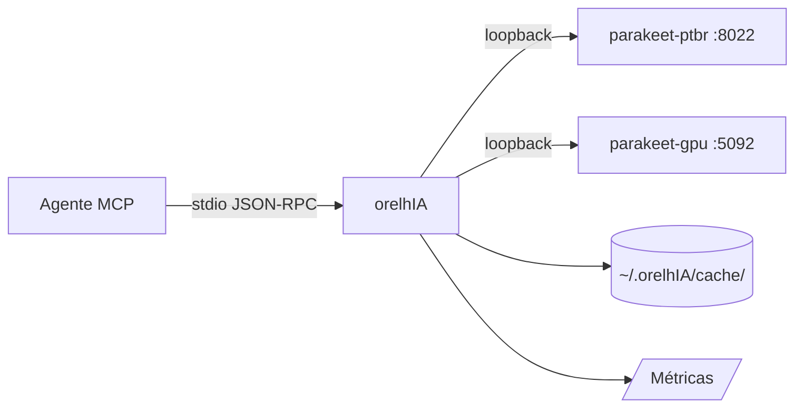

# orelhIA

> **Transcrição de áudio local, rápida e privada — para agentes MCP.**
>
> orelhIA · Parakeet TDT · Docker · Cache LRU · VAD · Métricas · PT-BR nativo

[](https://python.org)
[](https://modelcontextprotocol.io)
[](./LICENSE)
[](./tests/)
[](https://github.com/speaches-ai/speaches)

[🇧🇷 **Português**](#português) · [🇺🇸 **English**](./README.en.md) · [📐 **Architecture**](./docs/ARCHITECTURE.md) · [🤝 **Contributing**](./CONTRIBUTING.md)

---

## ⚡ TL;DR

```bash
# 1. Install (após o MCP já estar configurado)
pip install -e ".[dev,record]"

# 2. Bootstrap do container Parakeet (idempotente — Docker + imagem + container)
python -m parakeet_bootstrap

# 3. Transcrever!
python cli/whisper audio.ogg -l pt
# → "Olá, isto é um teste do orelhIA"
```

Via MCP (no seu agente):

```python
bootstrap_parakeet()        # instala e inicia (idempotente)
transcribe_file("/tmp/audio.ogg", language="pt")
# → {"text": "Olá, ...", "language": "pt", "duration": 4.5, "_meta": {...}}
```

---

## ✨ Features

| Categoria | O que tem |
|---|---|
| **Transcrição** | arquivo local · URL · microfone · com ou sem VAD |
| **Modelos** | 4 modelos Parakeet TDT (CPU + GPU CUDA) |
| **Backend** | Parakeet TDT 0.6B v3, **PT-BR nativo** (Alefiury/TAGARELA) |
| **Performance** | GPU 5-10× mais rápido que CPU · cache LRU 18.000× speedup em hits |
| **Segurança** | SSRF guard · safe redirect handler · MIME map · size limit · FD-safe temp |
| **Observabilidade** | métricas in-memory (contadores, latência, cache hit rate) |
| **DevEx** | stdlib-only onde possível · type hints · pytest · ruff + mypy |
| **Idempotência** | bootstrap re-detecta Docker, imagem, container, daemon |

---

## 🏗 Arquitetura



> Veja [`docs/ARCHITECTURE.md`](./docs/ARCHITECTURE.md) para diagramas completos (sequence, layered, security).

---

## 🚀 Quick start

### 1. Pré-requisitos

- **Python 3.10+**
- **Docker Desktop** (Windows/macOS) ou **Docker Engine** (Linux)
- **4 GB RAM** mínimo (8 GB recomendado para modelo grande)
- **GPU NVIDIA opcional** (CUDA 12.1+ para 5-10× speedup)

### 2. Instalação

```bash
# Clone (ou copie o diretório orelhIA/)
cd orelhIA

# Edite
pip install -e ".[dev,record]"
```

### 3. Configure o MCP client

Adicione ao seu `~/.pi/agent/mcp.json` (ou equivalente):

```json
{
  "mcpServers": {
    "whisper": {
      "command": "C:/Users/Evandro/AppData/Local/Programs/Python/Python312/python.exe",
      "args": ["C:/Users/Evandro/.pi/agent/mcp-servers/whisper/server.py"],
      "description": "Parakeet TDT transcription via parakeet-gpu container (RTX 3070, CUDA). v3.0",
      "timeout": 180,
      "lifecycle": "lazy",
      "idleTimeout": 10,
      "directTools": true,
      "environment": {
        "ORELHIA_BASE_URL": "http://localhost:5092",
        "ORELHIA_MODEL": "alefiury/parakeet-tdt-0.6b-v3-ptBR-TAGARELA-onnx",
        "ORELHIA_TIMEOUT": "120",
        "ORELHIA_MAX_BYTES": "26214400",
        "ORELHIA_CACHE_DIR": "C:/Users/Evandro/.orelhIA/cache",
        "ORELHIA_CACHE_MAX_ENTRIES": "128"
      }
    }
  }
}
```

### 4. Inicie o backend (idempotente)

```bash
python -m parakeet_bootstrap
```

Saída esperada:

```
[  5%] docker.check: Verificando Docker...
[ 15%] docker.check: Docker já instalado e rodando
[ 25%] image.check: Verificando imagem parakeet-tdt:ptbr-cpu...
[ 50%] image.check: Imagem parakeet-tdt:ptbr-cpu já presente
[ 80%] container.reuse: Container parakeet-ptbr já rodando, reusando
[ 75%] health.wait: Aguardando http://localhost:8022/health ficar healthy...
[  95%] health.wait: healthy após 1 tentativas
[100%] done: Bootstrap completo

[OK] parakeet rodando em http://localhost:8022
```

### 5. Use!

```bash
# CLI
python cli/whisper audio.ogg -l pt

# MCP (via agente)
transcribe_file("audio.ogg", language="pt")
```

---

## 🛠 Tools (MCP)

| Tool | O que faz | Parâmetros |
|---|---|---|
| `health()` | Status do backend + features | — |
| `transcribe_file(path, language?, model?, format?, preprocess?)` | Arquivo local → texto | `path` (obrigatório), demais opcionais |
| `transcribe_url(url, language?, model?)` | URL HTTP(S) → texto | `url` (obrigatório) |
| `record_audio(seconds, output_path?, language?, model?, sample_rate?)` | Microfone → texto | `seconds` (1-600) |
| `get_metrics()` | Contadores, latência, cache hit rate | — |
| `clear_cache()` | Limpa cache LRU | — |
| `bootstrap_parakeet(port?, image?, container?)` | Instala Docker + container (idempotente) | todos opcionais |

### Exemplo: transcrição com VAD

```python
transcribe_file(
    path="audio_com_silencio.wav",
    language="pt",
    preprocess="vad",  # remove silêncio antes de transcrever
)
```

### Exemplo: resposta de `get_metrics()`

```json
{
  "uptime_seconds": 3600.5,
  "requests": {
    "total": 150, "success": 147, "error": 3,
    "by_tool": {"transcribe_file": 120, "transcribe_url": 25, "record_audio": 3, "health": 2}
  },
  "cache": {"hits": 35, "misses": 85, "hit_rate": 0.29},
  "latency": {"total_ms": 180000.0, "avg_ms": 1200.0},
  "bytes_processed": 52428800
}
```

---

## 🐳 Bootstrap (instalar Parakeet)

O script `parakeet_bootstrap.py` é **idempotente** — pode rodar várias vezes sem efeito colateral.

| SO | Suporte | Como instala Docker |
|---|---|---|
| Windows 10/11 | ✅ | `winget` (ou `choco` como fallback) |
| Linux (qualquer) | ✅ | script oficial `get.docker.com` (com download + sanity cap) |
| macOS | ❌ | não suportado por design |

**Como MCP tool:** `bootstrap_parakeet()`  
**Como CLI:** `python -m parakeet_bootstrap`

Detecta automaticamente: Docker instalado, daemon rodando, imagem presente, container saudável.

---

## ⚙️ Configuração (env vars)

| Var | Default | Descrição |
|---|---|---|
| `ORELHIA_BASE_URL` | `http://localhost:5092` | URL do backend (GPU) |
| `ORELHIA_MODEL` | `alefiury/parakeet-tdt-0.6b-v3-ptBR-TAGARELA-onnx` | Modelo padrão |
| `ORELHIA_TIMEOUT` | `120` | Timeout (segundos) |
| `ORELHIA_MAX_BYTES` | `26214400` (25 MB) | Limite de tamanho |
| `ORELHIA_ALLOW_PRIVATE_URLS` | `false` | Libera SSRF guard (apenas dev) |
| `ORELHIA_CACHE_DIR` | `~/.orelhIA/cache` | Diretório do cache LRU |
| `ORELHIA_CACHE_MAX_ENTRIES` | `128` | Máximo de entries no cache |
| `ORELHIA_VAD_RMS_THRESHOLD` | `0.01` | Limiar RMS do VAD |
| `ORELHIA_RECORD_SAMPLE_RATE` | `16000` | Sample rate do microfone |
| `ORELHIA_LOG_LEVEL` | `INFO` | DEBUG / INFO / WARNING / ERROR |

---

## 🧪 Testes

```bash
pytest                                    # 26 testes
pytest tests/test_parakeet_bootstrap.py   # só o bootstrap
pytest --cov=.                            # com coverage
```

Stack: `pytest` + `unittest.mock` (sem rede, sem Docker).

---

## 🐛 Troubleshooting

| Sintoma | Causa | Fix |
|---|---|---|
| `health()` retorna `ok: false` | Backend offline | `python -m parakeet_bootstrap` |
| `connection_error` em `transcribe_url` | URL inacessível ou SSRF bloqueada | Verifique `ORELHIA_BASE_URL`; para dev: `ORELHIA_ALLOW_PRIVATE_URLS=true` |
| `file_too_large` | Áudio > 25 MB | Comprima: `ffmpeg -i in.mp3 -b:a 64k out.mp3` |
| `private_url_blocked` | URL em rede local | `ORELHIA_ALLOW_PRIVATE_URLS=true` |
| `http_error 503` | Modelo carregando | Aguarde ~30s; retry automático |
| `pyaudio_unavailable` | PyAudio não instalado | `pip install pyaudio` |
| GPU travou | WSL/Docker adapter caiu | `wsl --shutdown` (admin) + `docker start parakeet-gpu` |

---

## 📊 Performance

| Operação | CPU (TAGARELA) | GPU (istupakov) |
|---|---|---|
| Transcrição 30s | 4.8s | **2.4s** (1.4×) |
| Cache hit | <1ms | <1ms |
| Cold start (download modelo) | ~3min | ~3min |

---

## 🤝 Contributing

Veja [`CONTRIBUTING.md`](./CONTRIBUTING.md). Resumo:

1. Fork + branch
2. Mudanças com testes
3. `pytest` + `ruff check` passam
4. Atualizar `CHANGELOG.md`
5. PR com descrição clara

---

## 📜 Licença

[MIT](./LICENSE) — use, modifique, distribua à vontade.

---

## 🇨🇳 Créditos

- **Parakeet TDT 0.6B v3** — NVIDIA NeMo
- **TAGARELA pt-BR** — [Alefiury](https://huggingface.co/alefiury) fine-tune
- **Speaches** — [speaches-ai](https://github.com/speaches-ai/speaches)
- **faster-whisper** — [SYSTRAN](https://github.com/SYSTRAN/faster-whisper)
- **MCP** — [Model Context Protocol](https://modelcontextprotocol.io)

---

# English

[🇧🇷 Português](#orelhIA) · [🇺🇸 **English**](./README.en.md)

*See [README.en.md](./README.en.md) for the full English version.*
