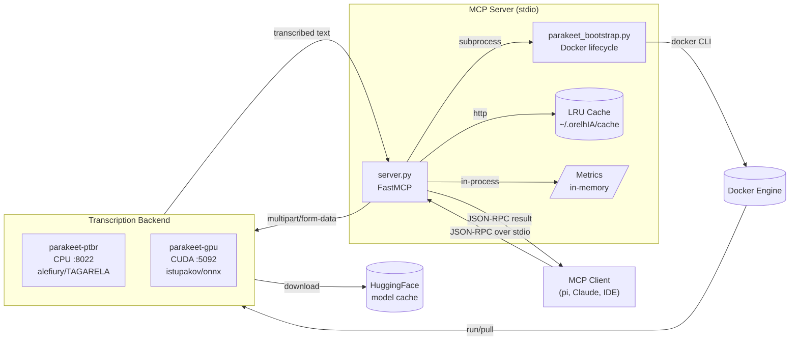
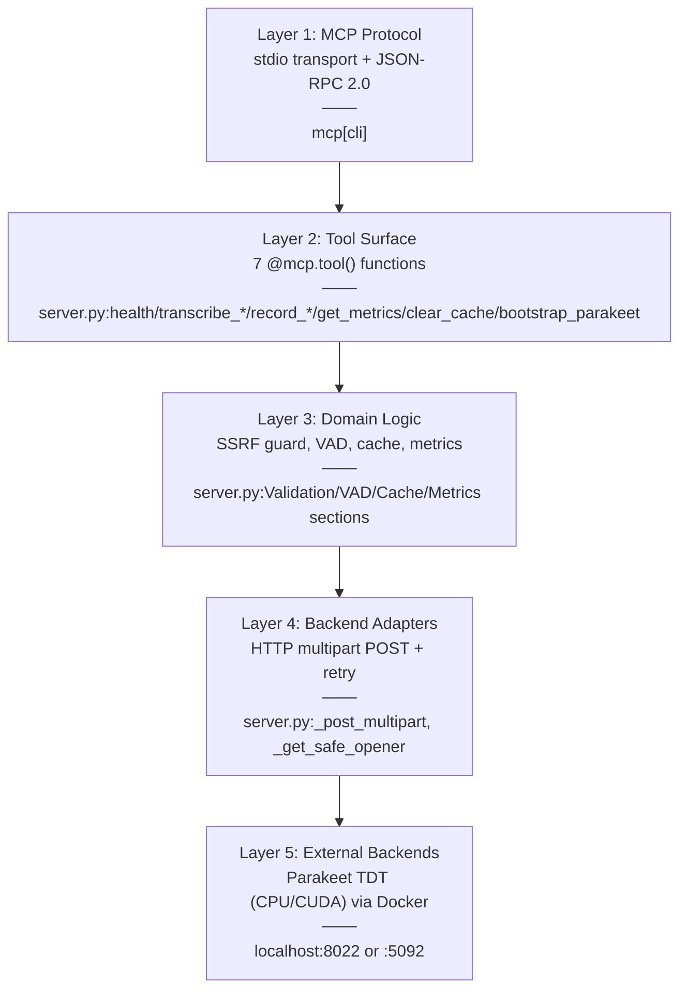
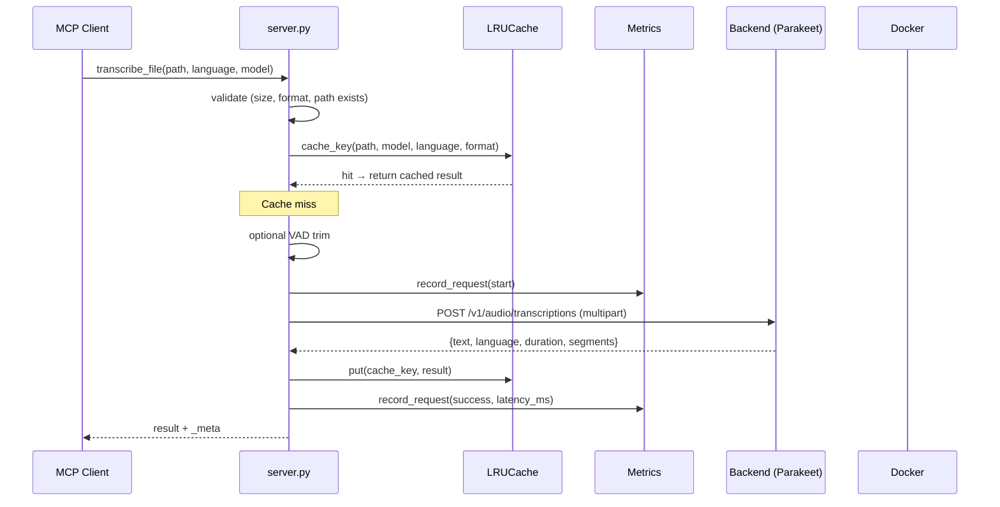
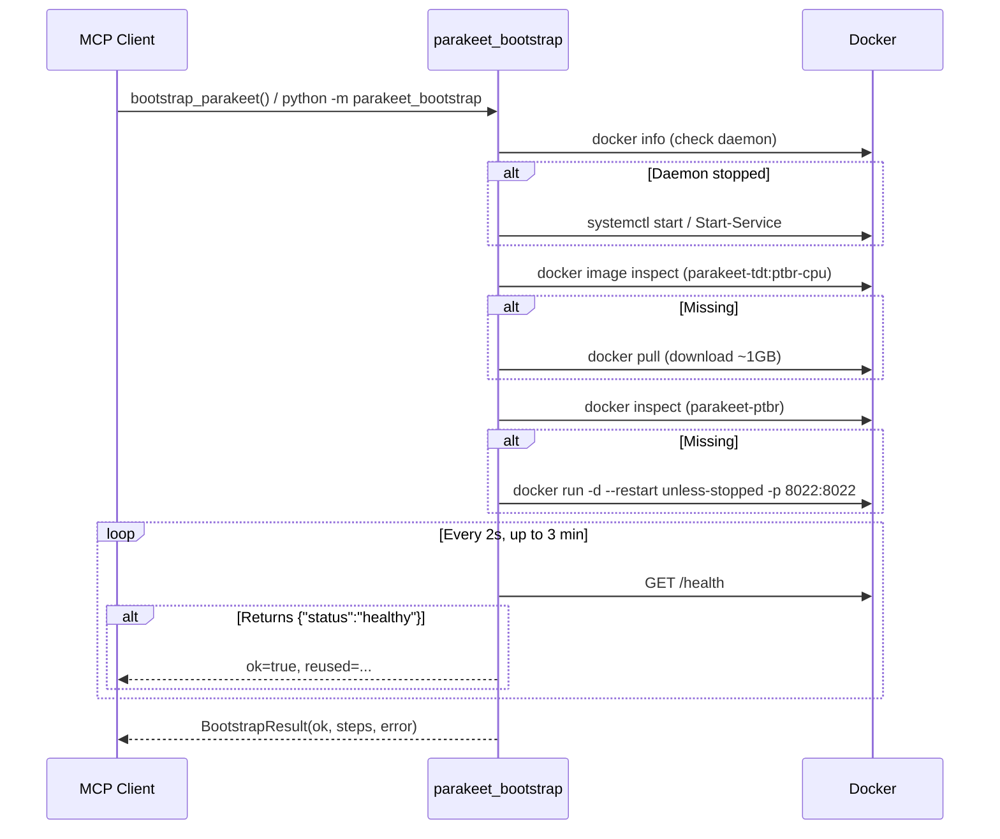
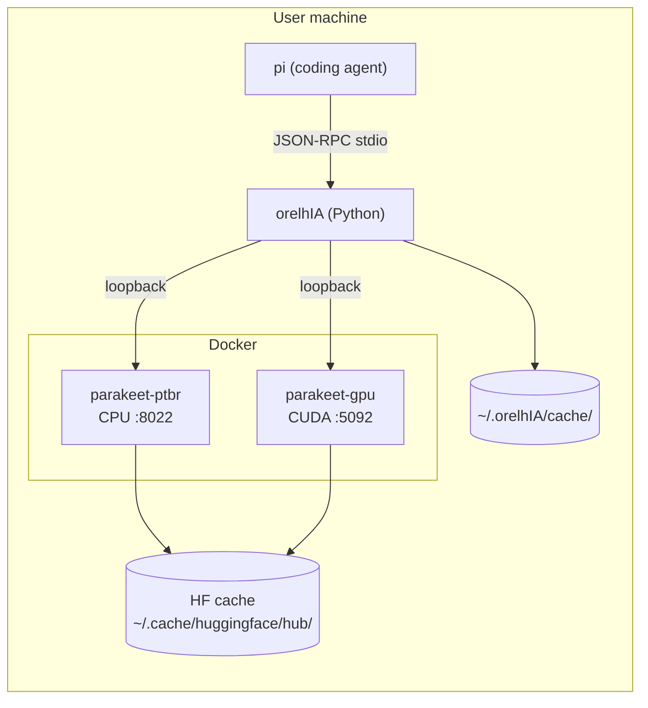

# Architecture

> Design rationale, system topology, and data flow for **orelhIA v3.0**.

## System overview

## Layered architecture

Each layer has **one job** and depends only on the layer below it.

## Module map

| File | Lines | Responsibility | Public surface |
|---|---|---|---|
| `server.py` | 1155 | MCP server, all 7 tools, domain logic | `mcp`, 7 `@mcp.tool()` |
| `parakeet_bootstrap.py` | 342 | Docker lifecycle, idempotent | `bootstrap()`, `main()` |
| `cli/whisper` | 112 | Standalone CLI using server as library | `main()` |
| `tests/test_parakeet_bootstrap.py` | 237 | Unit tests for bootstrap | 26 pytest cases |
| `pyproject.toml` | 80 | Build config, deps, ruff/mypy settings | — |

## Data flow — transcription

## Data flow — bootstrap

## Security model

| Concern | Defense |
|---|---|
| SSRF (private IP access via `transcribe_url`) | `_is_private_host()` blocks `127/8`, `10/8`, `172.16/12`, `192.168/16`, `169.254/16` |
| SSRF via HTTP redirect | `_SafeRedirectHandler` revalidates each 3xx hop |
| File path traversal | `Path(path).expanduser().resolve()` + `is_file()` check |
| Large file DoS | `ORELHIA_MAX_BYTES` (default 25 MB) |
| FD leak | `os.close(fd)` after `tempfile.mkstemp` |
| Pipe-to-shell RCE | `curl \| sh` replaced with download + size cap + exec |
| Temp file cleanup | `TemporaryDirectory` context manager (guaranteed) |
| MIME confusion | Explicit extension → MIME map (`.ogg`/`.opus`/`webm`) |

## Performance budget

| Operation | Typical latency (1st call) | Cached/2nd call |
|---|---|---|
| `transcribe_file` (1MB MP3, CPU) | ~2-3s | <1ms |
| `transcribe_file` (1MB MP3, GPU) | ~2s | <1ms |
| `transcribe_url` (download + transcribe) | ~3-5s | n/a |
| `record_audio` (5s @ 16kHz) | ~8s (record + transcribe) | n/a |
| `transcribe_file` with VAD (1MB WAV) | ~2s (after trim) | <1ms |
| `health()` | ~50ms | n/a |
| `bootstrap_parakeet()` (idempotent, image cached) | <2s | n/a |
| `bootstrap_parakeet()` (cold, first install) | ~5-10min | n/a |

## Deployment topology

## Why these choices

**Why stdlib-only where possible?**
- `urllib` instead of `requests` → fewer deps, no `requests-ossrf` middleware
- `tempfile` + `pathlib` instead of `shutil` hacks
- `json` + `dataclass` instead of `pydantic` overhead

**Why Docker over venv?**
- Parakeet TDT has heavy C++/CUDA deps (onnxruntime, cudnn) — not portable
- Docker image encapsulates model + runtime + system libs
- Idempotent restart semantics align with MCP lifecycle

**Why LRU cache over SQLite?**
- Audio is big (1-25MB), not many entries fit
- JSON index is human-readable, easy to inspect
- No migration story needed (one file)

**Why energy-based VAD over Silero/webrtcvad?**
- Zero new deps (stdlib struct.unpack)
- Sufficient for "remove silence before transcribe" use case
- Tradeoff: less accurate than ML-based, but <1ms vs 50ms for Silero
